## Tutoriel pas à pas du youtuber Teddy Smith  https://github.com/teddysmithdev/pokemon-review-api
---
# **Video 1 - Creer le projet**
https://www.youtube.com/watch?v=_8nLSsK5NDo&list=PL82C6-O4XrHdiS10BLh23x71ve9mQCln0&ab_channel=TeddySmith

---
1) Ouvrir visual studio et cliquer sur "create a new project" 

   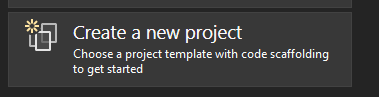
2) Rechercher pour Web Api 

   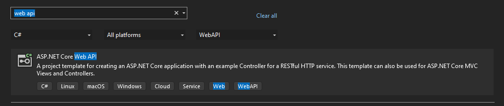
3) Nommez le PokemonReviewApp 

   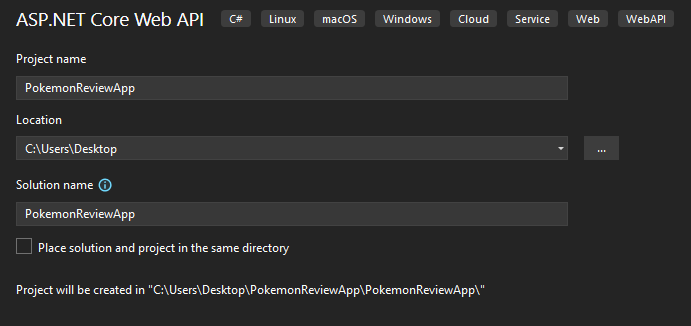
4) Assurez vous que dotnet 6 est sélectionné et que les check box sont correctement coché ( OpenApi pour swagger) 

   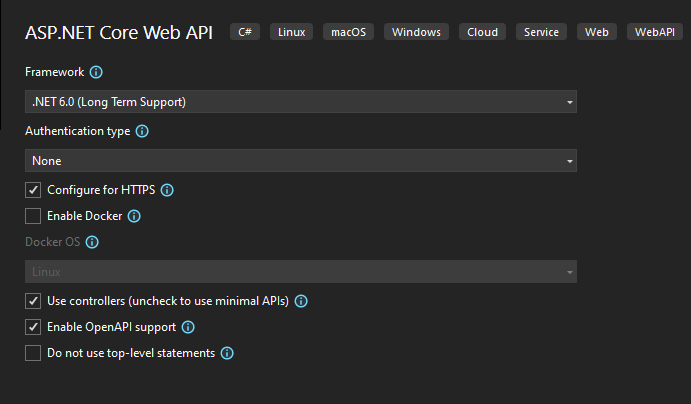
5) Supprimez WeatherForcast.cs , nous n'en avons pas besoin 

   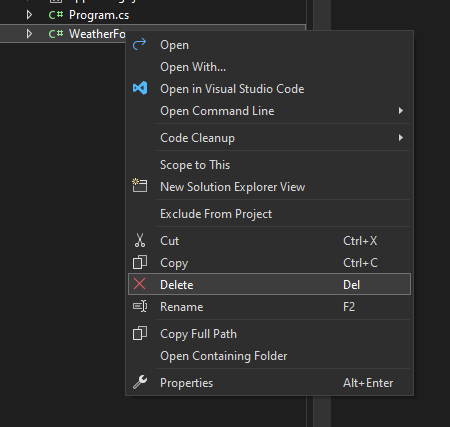
6) Supprimez WeatherForcastCoontroller.cs aussi 

   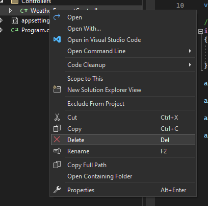
---
# **Video 2 - Models**
https://www.youtube.com/watch?v=BnlFovYeQtI&list=PL82C6-O4XrHdiS10BLh23x71ve9mQCln0&index=2&ab_channel=TeddySmith

---

1) Creer dossier "Models" : 

   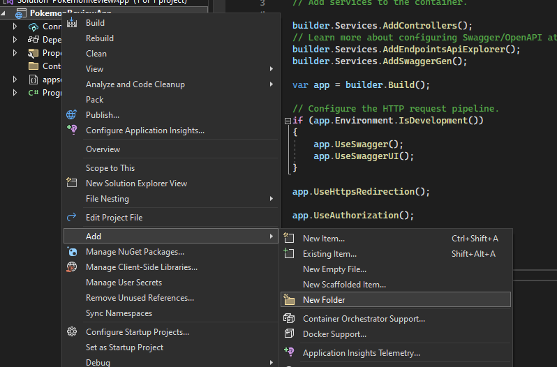 

   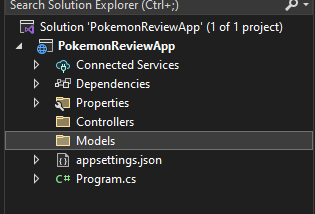
2) Dans le dossier Models, creez la classe Pokemon 

   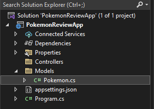
3) creer les attibuts de Pokemon, hint: taper "prop" pour avoir le code snippet "property" et écrire plus rapidement.

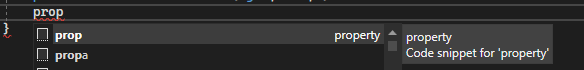

- Pokemon
```csharp
    namespace PokemonReviewApp.Models
{
    public class Pokemon
    {
        public int Id { get; set; }
        public string Name { get; set; }
        public DateTime BirthDate { get; set; }

    }
}
```
4) Dans le dossier Models, créer une classes pour cahque classe du diagramme UML qui sera une table de la base de donné: (Pokémon déjà fait) , Owner, Country, Category , Review, Reviewer 
   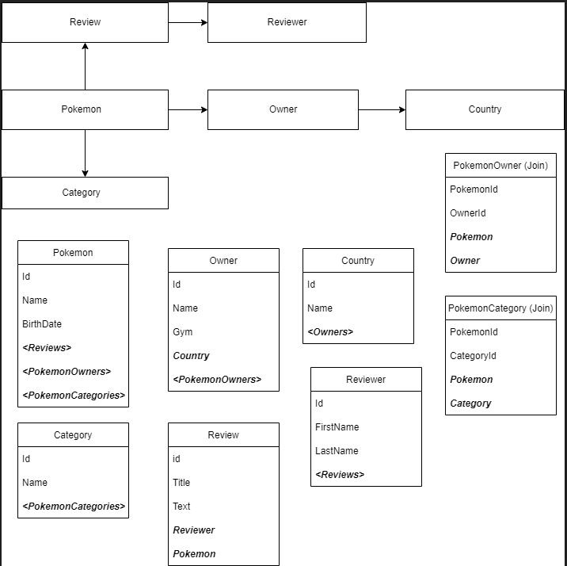
 
- Owner
```csharp
namespace PokemonReviewApp.Models
{
    public class Owner
    {
        public int Id { get; set; }
        public string Name { get; set; }
        public string Gym { get; set; }
    }
}

```
 - Country
```csharp
namespace PokemonReviewApp.Models
{
    public class Country
    {
        public int Id { get; set; }
        public string Name { get; set; }
    }
}

```
- Category
```csharp
namespace PokemonReviewApp.Models
{
    public class Category
    {
        public int Id { get; set; }
        public string Name { get; set; }
    }
}

```
- Review
```csharp
namespace PokemonReviewApp.Models
{
    public class Review
    {
        public int Id { get; set; }
        public string Title { get; set; }
        public string Text { get; set; }
    }
}
```
- Reviewer
```csharp
namespace PokemonReviewApp.Models
{
    public class Reviewer
    {
        public int Id { get; set; }
        public string FirstName { get; set; }
        public string LastName { get; set; }
    }
}
```

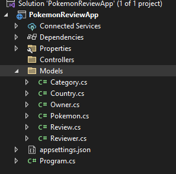

---
# **Video 3 - Relation Un-à-Plusieur**

https://www.youtube.com/watch?v=DWi-VHElmRE&list=PL82C6-O4XrHdiS10BLh23x71ve9mQCln0&index=3&ab_channel=TeddySmith

---

- Dans la relation Un-à-Plusieur, le coté "Plusieurs" prendra toujours la forme d'une liste dans l'attribut de la classe, donc un type ICollection<t>. Dans le diagramme UML, chaque "plusieur" est en italique entouré de crochet, tandisque chaque "Un" est simplement en italique. Nous allon donc créer une liste (ICollection) pour chaque attibut entouré de crochet dans chaque classe. 
1) Ajouter l'attribut suivante à la classe Pokemon:
```csharp
   public ICollection<Review> Reviews { get; set; }
```
2) Ajouter l'attibut suivant à la classe Country:
```csharp
public ICollection<Owner> Owners { get; set; }
```
3) Ajouter l'attibut suivant à la classe Reviewer:
```csharp
public ICollection<Review> Reviews { get; set; }
```
- Pour la relation "Un" , il suffit d'ajouter la classe dans la classe
  
1) Ajouter la classe "Country" dans la classe "Owner"
```csharp
public Country Country { get; set; }
```
2) Ajouter la classe "Reviewers" à la classe "Review"
```csharp
public Reviewer Reviewer { get; set; }
```
3) Ajouter la classe "Pokemon" à la classe "Review"
```csharp
public Pokemon Pokemon { get; set; }
```

---

# **Video 3 (encore) - Relation Plusieur-à-Plusieur**

https://www.youtube.com/watch?v=oOUSvRc3FMo&list=PL82C6-O4XrHdiS10BLh23x71ve9mQCln0&index=4&ab_channel=TeddySmith

---

- Dans une relation plusieur-à-plusieur, il faut créer une table de relation ( join table), qui contiendra les ID des 2 autres table qui sont en relation N-N. Il faut donc créer ces tables de relation dans le dossier "Models" vu qu'ils représentent un table dans la database.

1) Créer la classe "PokemonCategory" dans la dossier "Models" et tapez les attributs comme sur le schema UML:
```csharp
namespace PokemonReviewApp.Models
{
    public class PokemonCategory
    {
        public int PokemonId { get; set; }
        
        public int CategoryId { get; set; }
        public Pokemon Pokemon { get; set; }
        public Category Category { get; set; }
    }
}
```
2) Créer la classe "PokemonOwner" dans le dossier "Models" et tapez les attributs:
```csharp
namespace PokemonReviewApp.Models
{
    public class PokemonOwner
    {
        public int PokemonId { get; set; }
        
        public int OwnerId { get; set; }
        public Pokemon Pokemon { get; set; }
        public Owner Owner { get; set; }

    }
}
```
- Maintenant que nos table de relation sont créé, il faut retourner dans nos classe et ajouter la list ( ICollection<> ) qui contiendra les classe de relation ( se référer au schémas UML pour voire les relation plusieur à plusieur dans les classes).
3) Ajouter dans la classe "Pokemon" les listes de "PokemonOwner" et "PokemonCategory"
```csharp
public ICollection<PokemonOwner> PokemonOwners { get; set; }
public ICollection<PokemonCategory> PokemonCategories { get; set; }
```
4) Ajouter dans la class "Owner" la liste de "PokemonOwner"
```csharp
public ICollection<PokemonOwner> PokemonOwners { get; set; }
```
5) Ajouter dans la class "Category" la liste "PokemonCategory"
```csharp
public ICollection<PokemonCategory> PokemonCategories { get; set; }
```
---
# **Video 4 - Installing Entity Framework**

https://www.youtube.com/watch?v=EmV_IBYIlyo&list=PL82C6-O4XrHdiS10BLh23x71ve9mQCln0&index=5&ab_channel=TeddySmith

---

### 1) Installer SQL serveur pour la suite du tuto.
### 2) Créer la base de donner ***pokemonreview*** dans le SQL Server Management Studio 

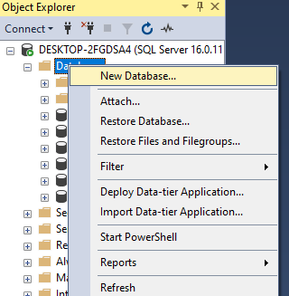

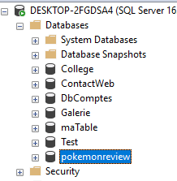
### 3) Récupérer la connection string:
   - Faite apparaitre le Sql Object Server Explorer dans View -> Sql Object server Explorer 
   
   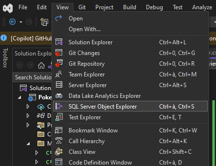
   - cliquer sur la deuxieme icone "add sql server" 

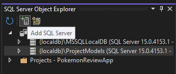
   - pour trouver le Server Name, retourner au SQL Server Management Studio, faite un clique droit sur votre nom de serveur, puis propriété 

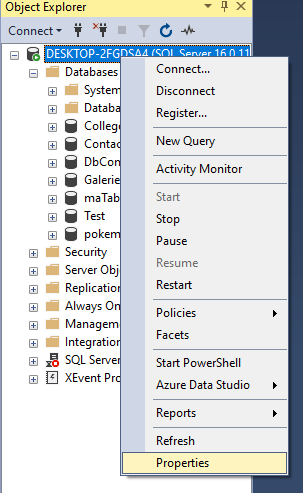
   - Dans la fenêtre qui s'ouvre, copié le server Name, puis aller le collé ensuite dans visual studio la ou on vous demande le server name 

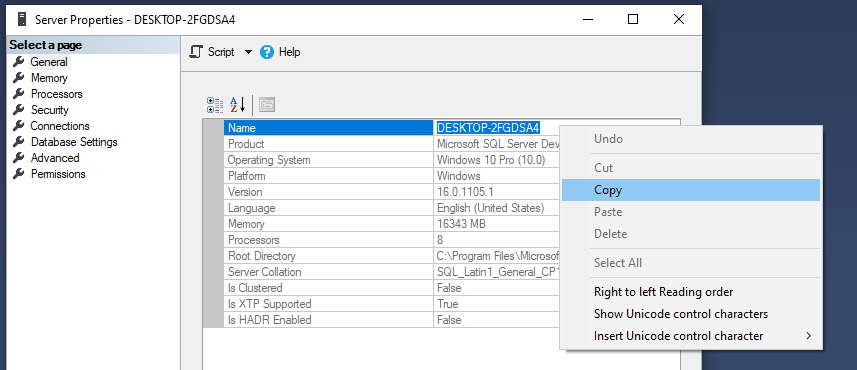
   - vous pourrez ensuite choisir dans le menu déroulant le nom de votre database (pokemonreview) 

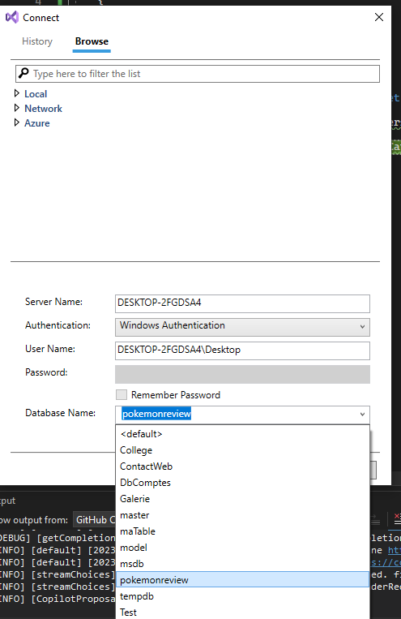
   - clique connect
   - Dans le SQL Server Object Explorer de visual studio,cliquer sur votre serveur, trouver votre database et  cliquer droit sur votre database, propriété 

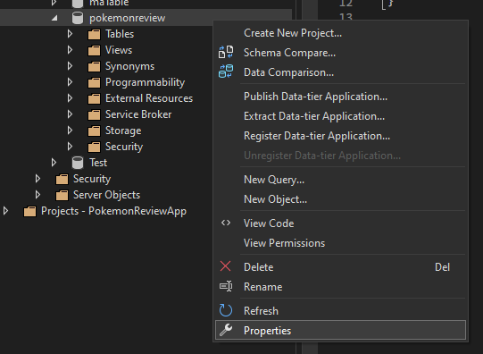
   - Cela va vous ouvrir une fenêtre de propriétés ou vous pourrez récupérer la connection string 

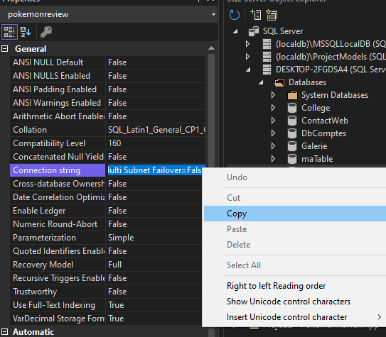
   - copié la connection string et allez la collé dans le fichier appsettings.json
```json
{
  "ConnectionStrings": {
    "DefaultConnection": "Data Source=DESKTOP-2FGDSA4;Integrated Security=True;Connect Timeout=30;Encrypt=False;Trust Server Certificate=False;Application Intent=ReadWrite;Multi Subnet Failover=False"
  },
  "Logging": {
    "LogLevel": {
      "Default": "Information",
      "Microsoft.AspNetCore": "Warning"
    }
  },
  "AllowedHosts": "*"
}
```
### 4) Récupérer Entity Framework avec les nuggets :
   - Clicque droit sur le PokemonReviewApp et choisir "Manage NUgget Packages" 

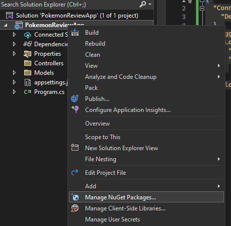
   - Installer Microsoft.EntityFrameworkCore.SqlServer

  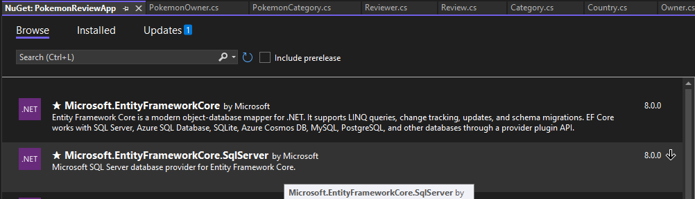
   - Choisir la version 7 de entity framework, car si on choisir la dernier version stable (8+) elle n'est pas compatible avec dotnet 6 

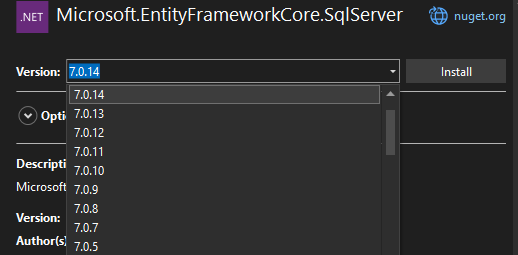
 - Toujours dans le nugget manager, choisir Microsoft.EntityframworkCore.Design

   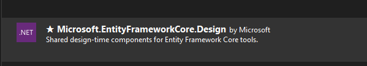
 - Choisir encore une fois une version 7 pour assurer la compatibiliter avec dotnet 6 

  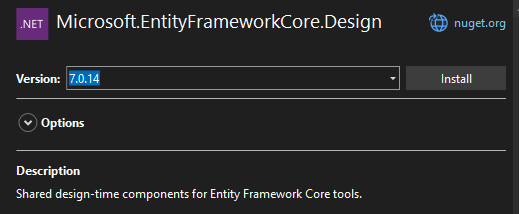
- Toujours dans le nugget manager, choisir Microsoft.EntityframworkCore.Tools

  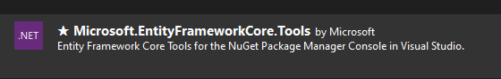
 - Choisir encore une fois une version 7 pour assurer la compatibiliter avec dotnet 6  Créer un dossir "Data" dans le projet afin de receuillir le DataContext

 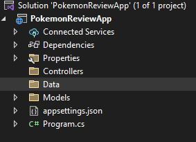
### 6) Créer la classe "DataContext" dans le dossier "Data" qui héritera de DBContext:

 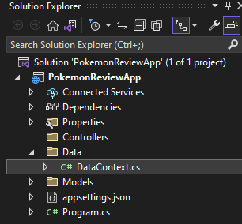
```csharp
namespace PokemonReviewApp.Data
{
    public class DataContext : DbContext
    {
    }
}

```
### 7) Crérer le constructeur de DataContext:
```csharp
 public DataContext(DbContextOptions<DataContext> options) : base(options)
        {
            
        }
```
### 8) Créer un DbSet pour chaque classe dans "Models" avec leur getters et setters
```csharp
public DbSet<Category> Categories { get; set; }
public DbSet<Owner> Owners { get; set; }
public DbSet<Country> Country { get; set; }
public DbSet<Pokemon> Pokemons { get; set; }
public DbSet<Review> Reviews { get; set; }
public DbSet<PokemonCategory> PokemonCategories { get; set; }
public DbSet<PokemonOwner> PokemonOwners { get; set; }
public DbSet<Reviewer> Reviewers { get; set; }
```
### 9) pour les table de relation plusieurs à plusieurs, il faut dire a EntityFramework comment les table sont en relation entre elle avec la methode OnModelCreating. Nous avons 2 tables de relation dans notre schéma UML, alors voici le code:

```csharp
// Méthode pour configurer les relations entre les tables pluaieurs à plusieurs
        protected override void OnModelCreating(ModelBuilder modelBuilder)
        {
            // Relation plusieurs à plusieurs entre les tables Pokemon et Category
            modelBuilder.Entity<PokemonCategory>()
                .HasKey(pc => new {pc.PokemonId, pc.CategoryId});
            modelBuilder.Entity<PokemonCategory>()
                .HasOne(pc => pc.Pokemon)
                .WithMany(p => p.PokemonCategories)
                .HasForeignKey(pc => pc.PokemonId);
            modelBuilder.Entity<PokemonCategory>()
                .HasOne(pc => pc.Category)
                .WithMany(c => c.PokemonCategories)
                .HasForeignKey(pc => pc.CategoryId);

            // Relation plusieurs à plusieurs entre les tables Pokemon et Owner
            modelBuilder.Entity<PokemonOwner>()
                .HasKey(po => new {po.PokemonId, po.OwnerId});
            modelBuilder.Entity<PokemonOwner>()
                .HasOne(po => po.Pokemon)
                .WithMany(p => p.PokemonOwners)
                .HasForeignKey(po => po.PokemonId);
            modelBuilder.Entity<PokemonOwner>()
                .HasOne(po => po.Owner)
                .WithMany(o => o.PokemonOwners)
                .HasForeignKey(po => po.OwnerId);
            

        }
```
### 10) AddDbContext Services in the app builder ( in Program.cs)
```csharp
builder.Services.AddDbContext<DataContext>(option =>
{ 
    option.UseSqlServer(builder.Configuration.GetConnectionString("DefaultConnection"));
});
```
### 11) Seeding la database. Pour mettre des données initialement dans la DB.
    - Créer une classe "Seed" è à la racine du projet 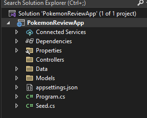
    - populer la classe "Seed" avec ce code : **voir le fichier Seed.cs pour le code**

 ### 12) Injecté le Seed avec le builder.Service du Program.cs et ajouter la méthode void SeedData dans Program.cs:
```csharp
   builder.Services.AddTransient<Seed>();
```
```csharp
if (args.Length == 1 && args[0].ToLower() == "seeddata")
    SeedData(app);

void SeedData(IHost app)
{
    var scopedFactory = app.Services.GetService<IServiceScopeFactory>();
    using (var scope = scopedFactory.CreateScope())
    {
        var service = scope.ServiceProvider.GetService<Seed>();
        service.SeedDataContext();
    }

}
```
### 13) Ajouter une migration
- Aller dans Tools -> nugget package manager -> package manager console 

- 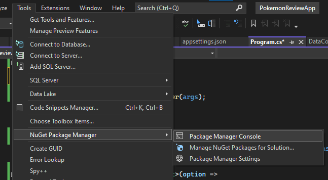
- Tapez dans la console :

        Add-Migration InitialCreate

  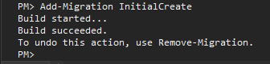
- Un nouveau dossier "Migration" sera créé dans votre projet 

 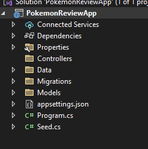

 - Pour sauvegarder dans la database, il faut entrer la commande dans le PMC :
  
        Update-Database

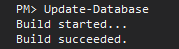
- Hors, même si la commande succeeded, de la façon que notre programme est fait, il faut lancer le programme en commandline avec 1 argument "seeddata" pour que la methode SeedData(app) soit apellé ( voire dna sle Program.cs la ligne )
```csharp
if (args.Length == 1 && args[0].ToLower() == "seeddata")
    SeedData(app);
```
Donc, pour ce faire, ouvrir un terminal dans le dossier racine du projet, pour ce faire aller dans view -> terminal

 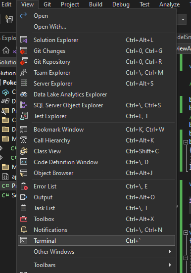

 Et tapez la commande suivante:
        
        cd PokemonReviewApp
        dotnet run seeddata

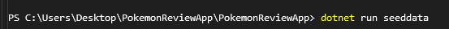
Maintenant vous pouvez vous assurez que vos table son bel et bien créé dans votre base de donner:

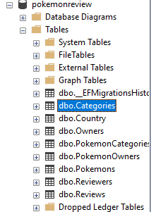

---

# **Video 5 - Le Repository Pattern et l'injection de dépendance**

https://www.youtube.com/watch?v=-LAeEQSfOQk&list=PL82C6-O4XrHdiS10BLh23x71ve9mQCln0&index=6&ab_channel=TeddySmith

---

### 1) Créer un dossier Interfaces, Repository et s'il n'existe pas déjà, un dossier Controllers

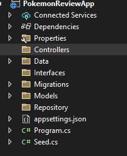

### 2) Créer une interface ( dans le dossier interfaces bien sûre), IPokemonRepository, et creer la signature d'une méthode "GetPokemons()" qui retourne un ICollection

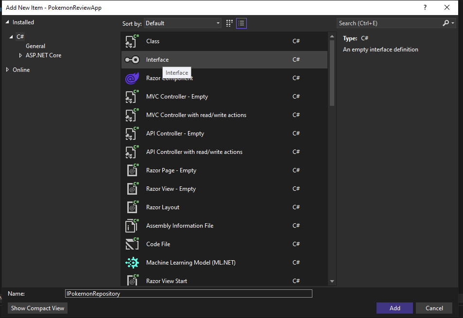

```csharp
public interface IPokemonRepository
    {
        ICollection<Pokemon> GetPokemons();
    }
```

### 3) Créer une implementation de l'interface dans le dossier "Repository". Nous le nommerons "PokemonRepository"

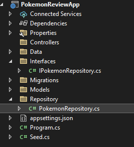
    
- créer un attribut privé de type DataContext et un constructeur qui prend en paramètre le DataContext
```csharp
 private readonly DataContext _context;
        public PokemonRepository(DataContext context)
        {
            _context = context;
        }
```

 - Implémenter la méthode GetPokemons() qui retourne une liste

```csharp
public ICollection<Pokemon> GetPokemons()
        {
            return _context.Pokemons.OrderBy(p => p.Id).ToList();
        }
```
### 4) Créer un controlleur Pokemon "PokemonController"
- Commencer par créer une classe PokemonController dans le dossier Controllers
- Pour que le Web Api sache que ceci est un controlleur, il faut lui dire avec ces ligne de code:
```csharp

using Microsoft.AspNetCore.Mvc;

namespace PokemonReviewApp.Controllers
{
    [Route("api/[controller]")]
    [ApiController]
    public class PokemonController : Controller
    {
    }
}

```
- **assurez vous d'importer le Microsoft.AspNetCore.Mvc et non le Microsoft.AspNetCore.Components**

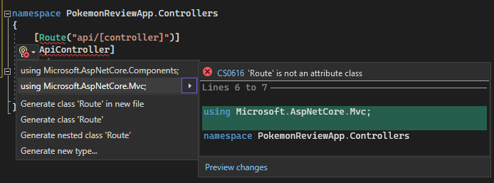
### 5) insérer ces ligne de code dans le controller qu ivalide si la requête HTTPGET est bonne , sinon il retourne une erreur, si oui il retourne la list de pokemons

```csharp

        [HttpGet]
        [ProducesResponseType(200, Type = typeof(IEnumerable<Pokemon>))]
        public IActionResult GetPokemon()
        {
            var pokemons = _pokemonRepository.GetPokemons();
            if (!ModelState.IsValid)
            {
                return BadRequest(ModelState);
            }
            return Ok(pokemons);
        }
```
### 6) Ajouter un Scopped Service dans le Program.cs avec cette ligne:
    
       builder.Services.AddScoped<IPokemonRepository, PokemonRepository>(); 

### 7) A ce stade l'on peux Run l'application pour voir si cela compile et s'il y a des erreurs avant de continuer. Si cela fonctionne, executer une requête GET avec swagger pour voir si l'application retourne des bonnes valeurs

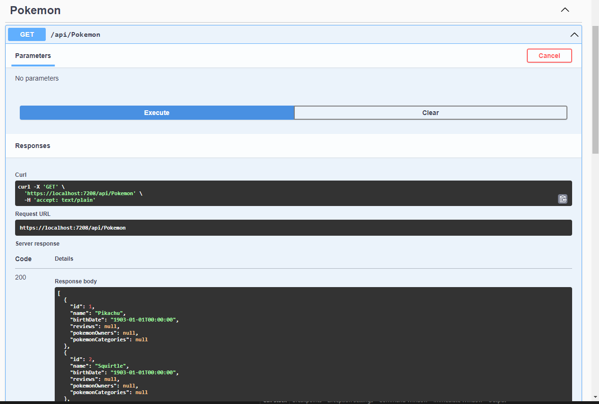

---

# **OK, NOW THE FUN BEGIN**


# **Video 6 - Get & Read Methods [Part1]**

https://www.youtube.com/watch?v=K4WuxwkXrIY&list=PL82C6-O4XrHdiS10BLh23x71ve9mQCln0&index=8&ab_channel=TeddySmith

---

### 1) Completez l'interface pour toute les méthodes
```csharp
using PokemonReviewApp.Models;

namespace PokemonReviewApp.Interfaces
{
    public interface IPokemonRepository
    {
        ICollection<Pokemon> GetPokemons();
        Pokemon GetPokemon(int Id);
        Pokemon GetPokemon(string name);
        decimal GetPokemonRating(int pokeId);
        bool PokemonExists(int pokeId);
    }
}

```

### 2) Implementer ces méthode dans le repository

```csharp
using PokemonReviewApp.Data;
using PokemonReviewApp.Interfaces;
using PokemonReviewApp.Models;

namespace PokemonReviewApp.Repository
{
    public class PokemonRepository : IPokemonRepository
    {
        private readonly DataContext _context;
        public PokemonRepository(DataContext context)
        {
            _context = context;
        }

        public Pokemon GetPokemon(int Id)
        {
            throw new NotImplementedException();
        }

        public Pokemon GetPokemon(string name)
        {
            throw new NotImplementedException();
        }

        public decimal GetPokemonRating(int pokeId)
        {
            throw new NotImplementedException();
        }

        public ICollection<Pokemon> GetPokemons()
        {
            return _context.Pokemons.OrderBy(p => p.Id).ToList();
        }

        public bool PokemonExists(int pokeId)
        {
            throw new NotImplementedException();
        }
    }
}

```
### 3) Remplacer toute les *NotImplementedExeption()* par leur implementation réèl

```csharp
using PokemonReviewApp.Data;
using PokemonReviewApp.Interfaces;
using PokemonReviewApp.Models;

namespace PokemonReviewApp.Repository
{
    public class PokemonRepository : IPokemonRepository
    {
        private readonly DataContext _context;
        public PokemonRepository(DataContext context)
        {
            _context = context;
        }

        public Pokemon GetPokemon(int id)
        {
            return _context.Pokemons.Where(p=> p.Id == id).FirstOrDefault();
        }

        public Pokemon GetPokemon(string name)
        {
           return _context.Pokemons.Where(p => p.Name == name).FirstOrDefault();
        }

        public decimal GetPokemonRating(int pokeId)
        {
            var reviews = _context.Reviews.Where(r => r.Pokemon.Id == pokeId);
            if(reviews.Count() <= 0)
                return 0;

            return ((decimal)reviews.Sum(r => r.Rating) / reviews.Count());
        }

        public ICollection<Pokemon> GetPokemons()
        {
            return _context.Pokemons.OrderBy(p => p.Id).ToList();
        }

        public bool PokemonExists(int pokeId)
        {
            return _context.Pokemons.Any(p => p.Id == pokeId);
        }
    }
}

```
# 4) Créez un DTO (data transfer Object). Pour ce faire, créer un folder DTO

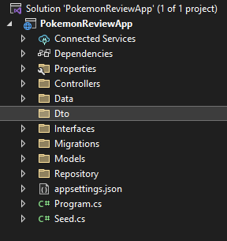

# 5) Créer une classe PokemonDto. Le Dto servira exposer seulement les methodes qui ne retourne pas des listes, pour des raison de sécurité. Pour ce faire , allez dans la classe Pokemon.cs et copié/collé juste les méthode que vous voulez exposer dans le Dto 

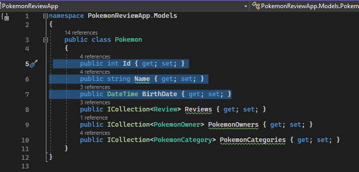


# 6) Maintenant nous pouvons allez dans notre controlleur et implementer les Requêtes Http de notre Dto. 
- Insérez ce code dans votre PokemonDto
```csharp


using Microsoft.AspNetCore.Mvc;
using PokemonReviewApp.Dto;
using PokemonReviewApp.Interfaces;
using PokemonReviewApp.Models;

namespace PokemonReviewApp.Controllers
{
    [Route("api/[controller]")]
    [ApiController]
    public class PokemonController : Controller
    {
        private readonly IPokemonRepository _pokemonRepository;
        public PokemonController(IPokemonRepository pokemonRepository)
        {
            _pokemonRepository = pokemonRepository;
        }

        [HttpGet]
        [ProducesResponseType(200, Type = typeof(IEnumerable<Pokemon>))]
        public IActionResult GetPokemon()
        {
            var pokemons = _pokemonRepository.GetPokemons();
            if (!ModelState.IsValid)
            {
                return BadRequest(ModelState);
            }
            return Ok(pokemons);
        }

        [HttpGet("{pokeId}")]
        [ProducesResponseType(200, Type = typeof(Pokemon))]
        [ProducesResponseType(400)]
        public IActionResult GetPokemon(int pokeId)
        {
            if (!_pokemonRepository.PokemonExists(pokeId))
                return NotFound();

            var pokemon = _pokemonRepository.GetPokemon(pokeId);

            if (!ModelState.IsValid)
                return BadRequest(ModelState);

            return Ok(pokemon);
        }

        [HttpGet("{pokeId}/rating")]
        [ProducesResponseType(200, Type = typeof(decimal))]
        [ProducesResponseType(400)]
        public IActionResult GetPokemonRating(int pokeId)
        {
            if (!_pokemonRepository.PokemonExists(pokeId))
                return NotFound();

            var rating = _pokemonRepository.GetPokemonRating(pokeId);

            if (!ModelState.IsValid)
                return BadRequest();

            return Ok(rating);
        }
    }
}

```

- Roules L'application, tester le Api avec swagger.

### 7) Enrichissement, pour enelever les valeurs null de la réponse, essayons de faire un AutoMapper. Avec le Nugget Manager, installer Automapper Depedency Injection:

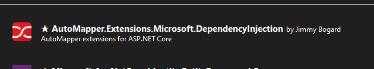

### 8) Créer un folder "Helper" et è l'intérieur la classe "MappingProfiles" qui hérite de "Profile"

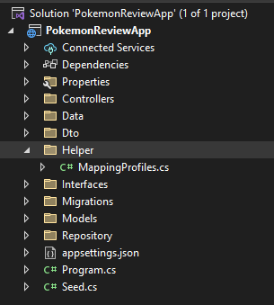

```csharp
using AutoMapper;

namespace PokemonReviewApp.Helper
{
    public class MappingProfiles : Profile
    {
    }
}

```

### 9) Allez dans le Program.cs pour connecter le AutoMapper

```csharp
builder.Services.AddAutoMapper(AppDomain.CurrentDomain.GetAssemblies());
```
### 10)Injecter un IMapper dans le constructeur avec un field Imapper mapper:
```csharp
 private readonly IPokemonRepository _pokemonRepository;
        private readonly IMapper _mapper;

        public PokemonController(IPokemonRepository pokemonRepository , IMapper mapper)
        {
            _pokemonRepository = pokemonRepository;
            _mapper = mapper;
        }

```
### 10) Voyez la puissance du AutoMapper en modifiant ces lignes de code dans chacune des fonction get qui ressemble a celle ci:  
        var pokemons = _pokemonRepository.GetPokemons();
### Par ceux ci:
- [HttpGet]
```
var pokemons = _mapper.Map<List<PokemonDto>>(_pokemonRepository.GetPokemons());
```
- [HttpGet("{pokeId}")]
```
var pokemon = _mapper.Map<PokemonDto>(_pokemonRepository.GetPokemon(pokeId));
```
# Bravo. Job done! Presque...
### 11) Run the application and test. 

---

# **Video 7 - Get & Read Methods [PART 2]**

https://www.youtube.com/watch?v=bSvYErXVRtQ&list=PL82C6-O4XrHdiS10BLh23x71ve9mQCln0&index=8&ab_channel=TeddySmith

---

### 1) Inspirez-vous de ce qui a déjà été créé jusqu'à maintenant, (*class Pokemon, Interface Pokemon, Impementation Pokemon, PokemonDto, PokemonController*) Puis écrivez toutes les autre classe du folder "Models" selon le même pattern: Faire l'interface, Faire le repository, faire le Dto, Faire le controlleur.

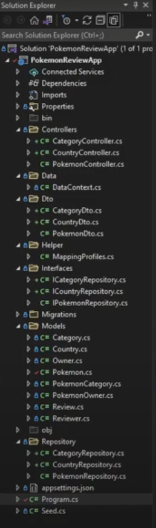

---
# **Video 8 - Get & Read Methods [PART 3]**

https://www.youtube.com/watch?v=FEanWuYq7us&list=PL82C6-O4XrHdiS10BLh23x71ve9mQCln0&index=9&ab_channel=TeddySmith

---

### 1) Même chose, ont continue a implémenter toute les classe selon le Repository design pattern

- Interface
- Dto
- Repository
- Controller
-  MappingProfiles

### 2) l'architecture devrais ressembler à ceci:

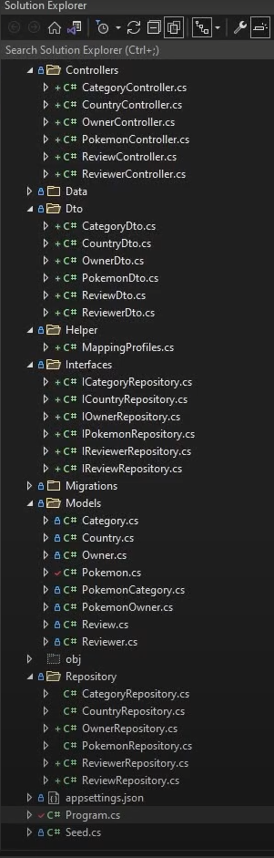
### 3) Compilez et tester chaque request avec le swagger

### 4) si vous rencontrez une erreur de life cycle, ajouter ces ligne de code dans le Program.cs :
```csharp
builder.Services.AddControllers().AddJsonOptions(x =>
                x.JsonSerializerOptions.ReferenceHandler = ReferenceHandler.IgnoreCycles);
```


### - Vous pouvez récupérer le projet exactement a cet instant:

     https://github.com/teddysmithdev/pokemon-review-api/tree/f86cc89f2b8f21314022d9902e5609bef02321ac

# - Pour commencer le projet avec les fichiers télécharger
1) Corrigé votre conection string
2) effacer votre dossier "Migration"
3) effacer votre database dans SQL server
4) Creé une nouvell database avec le nom pokemonreview
5) dans la console de Package Manager console faire:

        add-migration InitialCreate
        update-database
6) dans le commande line bash shell powershell demarrer le programme avec comme argument seeddata
   
        dotnet run seeddata

---

# **Video 9 - POST & Create Methods [PART 1]**

https://www.youtube.com/watch?v=HxLIIgxn3kg&list=PL82C6-O4XrHdiS10BLh23x71ve9mQCln0&index=12&ab_channel=TeddySmith

---

- Creation des "Create" qui sera appeller avec une requête POST
### 1) faire la signature du create dans les interface. Commençon par l'interface de Category. Allez dans ICategoryRepository.cs et ajouter la signature :
```csharp
bool CreateCategory(Category category);
``` 
### 2) Ajouter aussi une signature pour Save()
```csharp
bool Save();
```
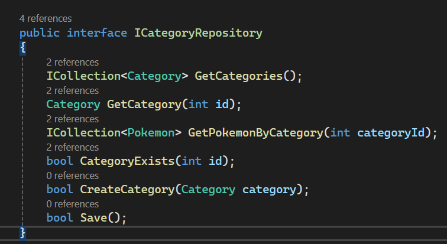

### 3) Implementer ces 2 fonctions dans le Repository

```csharp
 public bool CreateCategory(Category category)
 {
     _context.Add(category);
     return Save();
 }
```

```csharp
 public bool Save()
 {
     var saved = _context.SaveChanges();
     return saved > 0 ? true : false;
 }
```

### 4) Créer la methode POST dsans le controlleur correspondant (CategoryController)
```csharp
[HttpPost]
[ProducesResponseType(204)]
[ProducesResponseType(400)]
public IActionResult CreateCategory([FromBody] CategoryDto categoryCreate)
{
    if (categoryCreate == null)
        return BadRequest(ModelState);

    var category = _categoryRepository.GetCategories()
        .Where(c => c.Name.Trim().ToUpper() == categoryCreate.Name.Trim().ToUpper())
        .FirstOrDefault();

    if(category != null)
    {
        ModelState.AddModelError("", "Category already exist");
        return StatusCode(422, ModelState);
    }

    if (!ModelState.IsValid)
        return BadRequest(ModelState);

    var categoryMap = _mapper.Map<Category>(categoryCreate);

    if (!_categoryRepository.CreateCategory(categoryMap))
    {
        ModelState.AddModelError("", "Something went wrong while saving");
        return StatusCode(500, ModelState);
    }

    return Ok("Successfully created");
}
```

### 5) Ajouter cette ligne dans le MappingProfile du dossier Helper.
```csharp
CreateMap<CategoryDto,Category>();
```

### 6) vous devriez donc avoir un mapping dans les 2 sens comme ceci:

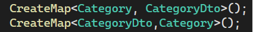

### 7) Executez le programme et tester avec swagger si la catergorie est bien créer


### 8) Répétez la même séquence pour chacune des autres classe du model pour les cas des table qui possède des clef étrangère ou des relations plusieur à plusieur, il vas falloir prendre en compte les contraintes. Voici le code de controlleur pour les différente classe pour la requete POST

---

# **Video 10 - POST & Create [part 2]**

https://www.youtube.com/watch?v=j0-cnsCZf7g&list=PL82C6-O4XrHdiS10BLh23x71ve9mQCln0&index=10&ab_channel=TeddySmith

---

## - Country -  Nécéssite rien de spécial

```csharp
        [HttpPost]
        [ProducesResponseType(204)]
        [ProducesResponseType(400)]
        public IActionResult CreateCountry([FromBody]       CountryDto countryCreate)
        {
            if (countryCreate == null)
                return BadRequest(ModelState);

            var country = _countryRepository.GetCountries()
                .Where(c => c.Name.Trim().ToUpper() == countryCreate.Name.TrimEnd().ToUpper())
                .FirstOrDefault();

            if (country != null)
            {
                ModelState.AddModelError("", "Country already exists");
                return StatusCode(422, ModelState);
            }

            if (!ModelState.IsValid)
                return BadRequest(ModelState);

            var countryMap = _mapper.Map<Country>(countryCreate);

            if (!_countryRepository.CreateCountry(countryMap))
            {
                ModelState.AddModelError("", "Something went wrong while savin");
                return StatusCode(500, ModelState);
            }

            return Ok("Successfully created");
        }
```
## - Owner - Nécessite 1 clef étrangère ( et une table de relation?)

```csharp
        [HttpPost]
        [ProducesResponseType(204)]
        [ProducesResponseType(400)]
        public IActionResult CreateOwner([FromQuery] int countryId, [FromBody] OwnerDto ownerCreate)
        {
            if (ownerCreate == null)
                return BadRequest(ModelState);

            var owners = _ownerRepository.GetOwners()
                .Where(c => c.LastName.Trim().ToUpper() == ownerCreate.LastName.TrimEnd().ToUpper())
                .FirstOrDefault();

            if (owners != null)
            {
                ModelState.AddModelError("", "Owner already exists");
                return StatusCode(422, ModelState);
            }

            if (!ModelState.IsValid)
                return BadRequest(ModelState);

            var ownerMap = _mapper.Map<Owner>(ownerCreate);

            ownerMap.Country = _countryRepository.GetCountry(countryId);

            if (!_ownerRepository.CreateOwner(ownerMap))
            {
                ModelState.AddModelError("", "Something went wrong while savin");
                return StatusCode(500, ModelState);
            }

            return Ok("Successfully created");
        }
```
## - Pokemon - Nécéssite 2 tables de relation
```csharp
[HttpPost]
        [ProducesResponseType(204)]
        [ProducesResponseType(400)]
        public IActionResult CreatePokemon([FromQuery] int ownerId, [FromQuery] int catId, [FromBody] PokemonDto pokemonCreate)
        {
            if (pokemonCreate == null)
                return BadRequest(ModelState);

            var pokemons = _pokemonRepository.GetPokemonTrimToUpper(pokemonCreate);

            if (pokemons != null)
            {
                ModelState.AddModelError("", "Owner already exists");
                return StatusCode(422, ModelState);
            }

            if (!ModelState.IsValid)
                return BadRequest(ModelState);

            var pokemonMap = _mapper.Map<Pokemon>(pokemonCreate);

      
            if (!_pokemonRepository.CreatePokemon(ownerId, catId, pokemonMap))
            {
                ModelState.AddModelError("", "Something went wrong while savin");
                return StatusCode(500, ModelState);
            }

            return Ok("Successfully created");
        }
```

## - Review - Nécéssite 2 clef étrangère
```csharp
[HttpPost]
        [ProducesResponseType(204)]
        [ProducesResponseType(400)]
        public IActionResult CreateReview([FromQuery] int reviewerId, [FromQuery]int pokeId, [FromBody] ReviewDto reviewCreate)
        {
            if (reviewCreate == null)
                return BadRequest(ModelState);

            var reviews = _reviewRepository.GetReviews()
                .Where(c => c.Title.Trim().ToUpper() == reviewCreate.Title.TrimEnd().ToUpper())
                .FirstOrDefault();

            if (reviews != null)
            {
                ModelState.AddModelError("", "Review already exists");
                return StatusCode(422, ModelState);
            }

            if (!ModelState.IsValid)
                return BadRequest(ModelState);

            var reviewMap = _mapper.Map<Review>(reviewCreate);

            reviewMap.Pokemon = _pokemonRepository.GetPokemon(pokeId);
            reviewMap.Reviewer = _reviewerRepository.GetReviewer(reviewerId);
            

            if (!_reviewRepository.CreateReview(reviewMap))
            {
                ModelState.AddModelError("", "Something went wrong while savin");
                return StatusCode(500, ModelState);
            }

            return Ok("Successfully created");
        }
```

## - Reviewer - Nécessite rien de spécial
```csharp
 [HttpPost]
        [ProducesResponseType(204)]
        [ProducesResponseType(400)]
        public IActionResult CreateReviewer([FromBody] ReviewerDto reviewerCreate)
        {
            if (reviewerCreate == null)
                return BadRequest(ModelState);

            var country = _reviewerRepository.GetReviewers()
                .Where(c => c.LastName.Trim().ToUpper() == reviewerCreate.LastName.TrimEnd().ToUpper())
                .FirstOrDefault();

            if (country != null)
            {
                ModelState.AddModelError("", "Country already exists");
                return StatusCode(422, ModelState);
            }

            if (!ModelState.IsValid)
                return BadRequest(ModelState);

            var reviewerMap = _mapper.Map<Reviewer>(reviewerCreate);

            if (!_reviewerRepository.CreateReviewer(reviewerMap))
            {
                ModelState.AddModelError("", "Something went wrong while savin");
                return StatusCode(500, ModelState);
            }

            return Ok("Successfully created");
        }
```

---

# **Video 11 - Update & Put**

https://www.youtube.com/watch?v=fzEHSF7uVA4&list=PL82C6-O4XrHdiS10BLh23x71ve9mQCln0&index=11&ab_channel=TeddySmith

---

### 1) Update Category:
- ajouter la signature dans l'interface
```csharp
bool UpdateCategory(Category category);
```
- implementer la méthode dans le repository
```csharp
 public bool UpdateCategory(Category category)
        {
            _context.Update(category);
            return Save();
        }
```
- écrire la requête PUT dans le controlleur
```csharp
 [HttpPut("{categoryId}")]
        [ProducesResponseType(400)]
        [ProducesResponseType(204)]
        [ProducesResponseType(404)]
        public IActionResult UpdateCategory(int categoryId, [FromBody]CategoryDto updatedCategory)
        {
            if (updatedCategory == null)
                return BadRequest(ModelState);

            if (categoryId != updatedCategory.Id)
                return BadRequest(ModelState);

            if (!_categoryRepository.CategoryExists(categoryId))
                return NotFound();

            if (!ModelState.IsValid)
                return BadRequest();

            var categoryMap = _mapper.Map<Category>(updatedCategory);

            if(!_categoryRepository.UpdateCategory(categoryMap))
            {
                ModelState.AddModelError("", "Something went wrong updating category");
                return StatusCode(500, ModelState);
            }

            return NoContent();
        }
```

### 2) Update Country : répéter les mêmes étapes qu'avec Update Category

### 3) Update Owner : même chose.

### 4) Update Pokemon: A cause de ses relation plus complexe, il faut ajouter des ID supplémentaire comme suit:
```csharp
[HttpPut("{pokeId}")]
        [ProducesResponseType(400)]
        [ProducesResponseType(204)]
        [ProducesResponseType(404)]
        public IActionResult UpdatePokemon(int pokeId, 
            [FromQuery] int ownerId, [FromQuery] int catId,
            [FromBody] PokemonDto updatedPokemon)
        {
            if (updatedPokemon == null)
                return BadRequest(ModelState);

            if (pokeId != updatedPokemon.Id)
                return BadRequest(ModelState);

            if (!_pokemonRepository.PokemonExists(pokeId))
                return NotFound();

            if (!ModelState.IsValid)
                return BadRequest();

            var pokemonMap = _mapper.Map<Pokemon>(updatedPokemon);

            if (!_pokemonRepository.UpdatePokemon(ownerId, catId,pokemonMap))
            {
                ModelState.AddModelError("", "Something went wrong updating owner");
                return StatusCode(500, ModelState);
            }

            return NoContent();
        }
```

### 5) Update Reviewer: rien de spécial, comme Owner, ou Country, ou Category
```csharp
[HttpPut("{reviewerId}")]
        [ProducesResponseType(400)]
        [ProducesResponseType(204)]
        [ProducesResponseType(404)]
        public IActionResult UpdateReviewer(int reviewerId, [FromBody] ReviewerDto updatedReviewer)
        {
            if (updatedReviewer == null)
                return BadRequest(ModelState);

            if (reviewerId != updatedReviewer.Id)
                return BadRequest(ModelState);

            if (!_reviewerRepository.ReviewerExists(reviewerId))
                return NotFound();

            if (!ModelState.IsValid)
                return BadRequest();

            var reviewerMap = _mapper.Map<Reviewer>(updatedReviewer);

            if (!_reviewerRepository.UpdateReviewer(reviewerMap))
            {
                ModelState.AddModelError("", "Something went wrong updating owner");
                return StatusCode(500, ModelState);
            }

            return NoContent();
        }
```

### 6)  Update Review: même chose, inpirez-vous de reviewer.

---
# **Video 12 - DELETE Methods**

https://www.youtube.com/watch?v=iEblTZ17PN4&list=PL82C6-O4XrHdiS10BLh23x71ve9mQCln0&index=13&ab_channel=TeddySmith

---

### 1) Vous connaissez la routine: 
- Ajouter la signature de la méthode Delete dans l'interface
- implementer l'interface dans le Repository
- Ajouter la requête Delete dans le controlleur

**Interface** -ICategoryRepository

```csharp
bool DeleteCategory(Category category);
```
**Repository** -CategoryRepository
```csharp
public bool DeleteCategory(Category category)
        {
            _context.Remove(category);
            return Save();
        }
```
**Controlleur** -CategoryController
```csharp
        [HttpDelete("{categoryId}")]
        [ProducesResponseType(400)]
        [ProducesResponseType(204)]
        [ProducesResponseType(404)]
        public IActionResult DeleteCategory(int categoryId)
        {
            if(!_categoryRepository.CategoryExists(categoryId))
            {
                return NotFound();
            }

            var categoryToDelete = _categoryRepository.GetCategory(categoryId);

            if (!ModelState.IsValid)
                return BadRequest(ModelState);

            if(!_categoryRepository.DeleteCategory(categoryToDelete))
            {
                ModelState.AddModelError("", "Something went wrong deleting category");
            }

            return NoContent();
        }
```

### 2) Même chose pour Country, Owner

### 3) Pour la table Pokemon, il faudra effacer aussi les reviews. Il faudrau donc implementer une méthode qui efface toute les review associé a ce pokémon, avec quelque chose comme ceci:
```csharp
 if (!_reviewRepository.DeleteReviews(reviewsToDelete.ToList()))
```
### En passant une liste à EntityFramework, l'on peux effacer un range de valeur. 

- Mettre en standyBy le Controlleur Pokemon, nous y reviendrons plus tard, il faut aller à Review pour implementer sa methode Delete et une Méthode DeleteRange.

### ReviewRepository.cs
```csharp
  public bool DeleteReview(Review review)
        {
           _context.Remove(review);
            return Save();
        }

        public bool DeleteReviews(List<Review> reviews)
        {
            _context.RemoveRange(reviews);
            return Save();
        }
```
### ReviewController.cs
```csharp
 [HttpDelete("{reviewId}")]
        [ProducesResponseType(400)]
        [ProducesResponseType(204)]
        [ProducesResponseType(404)]
        public IActionResult DeleteReview(int reviewId)
        {
            if (!_reviewRepository.ReviewExists(reviewId))
            {
                return NotFound();
            }

            var reviewToDelete = _reviewRepository.GetReview(reviewId);

            if (!ModelState.IsValid)
                return BadRequest(ModelState);

            if (!_reviewRepository.DeleteReview(reviewToDelete))
            {
                ModelState.AddModelError("", "Something went wrong deleting owner");
            }

            return NoContent();
        }
```
### 4) Nous pouvons revenir finir le controlleur Pokemon

```csharp
 [HttpDelete("{pokeId}")]
        [ProducesResponseType(400)]
        [ProducesResponseType(204)]
        [ProducesResponseType(404)]
        public IActionResult DeletePokemon(int pokeId)
        {
            if (!_pokemonRepository.PokemonExists(pokeId))
            {
                return NotFound();
            }

            var reviewsToDelete = _reviewRepository.GetReviewsOfAPokemon(pokeId);
            var pokemonToDelete = _pokemonRepository.GetPokemon(pokeId);

            if (!ModelState.IsValid)
                return BadRequest(ModelState);

            if (!_reviewRepository.DeleteReviews(reviewsToDelete.ToList()))
            {
                ModelState.AddModelError("", "Something went wrong when deleting reviews");
            }

            if (!_pokemonRepository.DeletePokemon(pokemonToDelete))
            {
                ModelState.AddModelError("", "Something went wrong deleting owner");
            }

            return NoContent();
        }
```

### 5) Faire le Reviewer, pareil que comme les autres (sauf Pokemon)

# **FÉLICITATION , Job Fini**
# Merci à Teddy Smith
